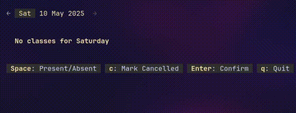

# Go-Attend: Attendance Tracker TUI

<p align="center">
  
</p>

## Key Features

- **Pure Go, Zero External Dependencies, only Standard library** 
- **Interactive TUI** 
- **Daily Attendance Tracking and Date navigation** 
- **Simple INI Configuration** 
- **Local CSV Data Storage**
- **Show Subject/Day wise Attendance Statistics**
- **Dynamic Schedule Handling**
- **Linux and MacOS Support**

## Installation

### From Go
1. **Install Go**
2. **Install the package**:
    ```bash
    go install github.com/sahaj-b/go-attend@latest
    # This will install the go-attend binary in $GOBIN, make sure it's in your PATH
    ```

### From Releases
1. **Download the executable file** from the [Releases page](https://github.com/sahaj-b/go-attend/releases).
2. **Make the file executable**:
    ```bash
    # Rename if needed
    # Add execute permissions
    chmod +x path/to/go-attend
    # MacOS users also need to run this command:
    # xattr -d com.apple.quarantine path/to/go-attend
    ```
3. **Move the executable to a directory in your `PATH`**:
    ```bash
    sudo mv /path/to/go-attend /usr/local/bin/
    ```

## Usage
### Recording Attendance
```
Usage: go-attend [date|options]
Date format: DD-MM-YYYY
Options:
  config-file           Show config file path
  stats                 Show stats
  stats -h              Show stats usage and flags
  -h, -help             Show this help message
```
#### Examples:
- To start tracking attendance for the current day:
  ```bash
  go-attend
  ```
- To record attendance for specific date:
```bash
  go-attend 01-08-2025
```

> [!TIP]
> Use Left/Right Arrow keys to navigate between dates
> Vim Bindings (h/j/k/l) are also available for the pros

### Show Statistics
```
Usage: go-attend stats [flags]
Flags:
  -end string
        End date for the stats (format: DD-MM-YYYY)
  -start string
        Start date for the stats (format: DD-MM-YYYY)
  -weekday
        Show weekday-wise stats (default: subject wise)
  -h, -help
        Show this help message
```
#### Examples:
- To show subject-wise stats
```bash
  go-attend stats
```
- To show weekday-wise stats for April 2025
```bash
  go-attend stats -weekday -start 01-04-2025 -end 31-04-2025
```

## Configuration
> [!NOTE]
> See [config_template.ini](./config/config_template.ini) for all the configuration options

On its first run, go-attend will create a default config.ini file (from [config_template.ini](./config/config_template.ini)) if one doesn't exist
**Run `go-attend config-file` to get the path to your config file**

Default Locations (`$XDG_CONFIG_HOME`):
- Linux: `~/.config/go-attend/config.ini`
- macOS: `~/Library/Application Support/go-attend/config.ini`

## Data Storage
Attendance records are stored in a CSV file
Default Locations (`$XDG_DATA_HOME`):
- Linux: `~/.local/share/go-attend/attendance.csv`
- macOS: `~/Library/Application Support/go-attend/attendance.csv`

## Build Instructions

You'll need Go (version 1.24.2 or newer) installed on your system.

1.  **Clone the repository**
    ```bash
    git clone https://github.com/sahaj-b/go-attend.git
    cd go-attend
    ```

2.  **Build the executable:**
    ```bash
    go build -o go-attend
    ```
3. **Move the `go-attend` executable to a directory in your `PATH`**:

    ```bash
    sudo mv go-attend /usr/local/bin/
    ```

<details>
<summary>Todo</summary>
<br>

- [x] TUI rendering (MVP)
- [x] State creation and management from scratch (MVP)
- [x] `store.go`: handle attendance storage in csv
- [x] move state logic in `state.go`
- [x] add tests for `store.go`
- [x] add date changing functionality in State
- [x] add caching for State items
- [x] cache records in `store.go`
- [x] refactor `store.go`: make CSVStore implementing DataStore interface
- [x] chore: split into different packages
- [x] refactor: fix cyclic imports
- [x] use strings.Builder instead of concatenation?
- [x] `ini_parser.go`: parse timetable, startDate, etc
- [x] copy template config on first run
- [x] handle schedule change (subjects added/removed/both)
- [x] fix store tests
- [x] handle duplicate subjects
- [x] add tests for `ini_parser.go`
- [x] save only if state is changed
- [x] handle unscheduled_as_cancelled config
- [x] make `stats.go` for attendance stats
- [x] make `stats_view.go` for stats display
- [x] handle arguments: start/end, date, remove record, rename subject etc
- [x] README: add build, install and usage instructions
- [ ] CI/CD: github actions, releases
- [ ] add rename subject functionality in CLI
- [ ] publish to AUR?
- [ ] support windows using `term` package? (ain't gonna happen)

</details>
